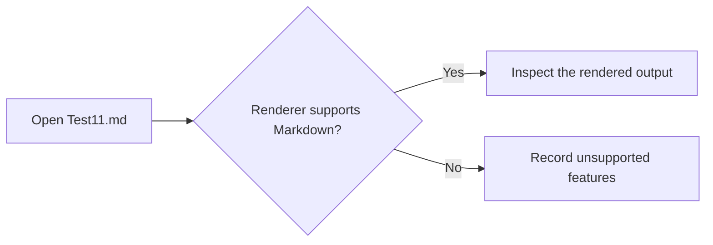

# Markdown Rendering Test Fixture

This document is a deliberately varied Markdown sample for testing rendering, navigation, syntax highlighting, accessibility, and edge cases.

> [!NOTE]
> Some sections use GitHub Flavored Markdown, raw HTML, Mermaid, and LaTeX-like math syntax. Renderers may support these features differently.

## Table of contents

- [Basic formatting](#basic-formatting)
- [Links](#links)
- [Images](#images)
- [Lists](#lists)
- [Tables](#tables)
- [Quotes and alerts](#quotes-and-alerts)
- [Code blocks](#code-blocks)
- [HTML elements](#html-elements)
- [Mathematics](#mathematics)
- [Mermaid diagram](#mermaid-diagram)
- [Footnotes](#footnotes)
- [Rendering edge cases](#rendering-edge-cases)

## Heading levels

# Heading 1

## Heading 2

### Heading 3

#### Heading 4

##### Heading 5

###### Heading 6

## Basic formatting

This paragraph contains **bold text**, *italic text*, ***bold italic text***, ~~strikethrough text~~, `inline code`, and escaped characters such as \*literal asterisks\*.

Use <u>underlined HTML text</u>, <mark>highlighted text</mark>, and <sub>subscript</sub>/<sup>superscript</sup> where the renderer supports inline HTML.

This line ends with two spaces  
so the next text starts on a new line.

---

## Links

- [JetBrains](https://www.jetbrains.com/)
- [IntelliJ IDEA documentation](https://www.jetbrains.com/help/idea/)
- [A relative link to a sample](Test10.kt)
- [A section link](#tables)
- <https://www.example.com/auto-linked>
- <mailto:markdown@example.com>

Reference-style links are supported by many renderers: [the JetBrains homepage][jetbrains-home].

[jetbrains-home]: https://www.jetbrains.com/ "JetBrains homepage"

## Images


The image above has alternative text. The following image is also a link:

[](https://www.jetbrains.com/)

## Lists

### Unordered lists

- First level item
  - Nested item
    - Third-level item
- Item with **formatted text**
- Item with `inline code`

### Ordered lists

1. Install an IDE.
2. Open the sample directory.
   1. Select a project entry point.
   2. Inspect the rendered Markdown.
3. Compare the result with another renderer.

### Task lists

- [x] Add headings and paragraphs
- [x] Add links and tables
- [x] Add code samples
- [ ] Compare rendering in multiple IDEs
- [ ] Record unsupported features

## Tables

### Aligned table

| IDE | Primary sample | Status | Score |
|:---|:---|:---:|---:|
| IntelliJ IDEA | `Test10.kt` | Ready | 10 |
| PyCharm | `Test20.py` | Ready | 9 |
| RustRover | `Test30.rs` | Ready | 8 |
| GoLand | `Test40.go` | Review | 7 |

### Table with multiline cells

| Feature | Details |
| --- | --- |
| Formatting | Bold, italic, code, and ~~deleted~~ text<br>in one cell |
| Links | [External](https://www.jetbrains.com/) and [relative](Test10.kt) |
| Symbols | Pipes `\|`, underscores `a_b`, and backticks `` `code` `` |

## Quotes and alerts

> This is a blockquote.
>
> It can contain multiple paragraphs and **formatting**.
>
> > This is a nested blockquote.

GitHub-style alerts may render as callouts:

> [!TIP]
> Use a short, descriptive alt text for every meaningful image.

> [!WARNING]
> Raw HTML and advanced extensions are not supported by every Markdown renderer.

## Code blocks

Inline command: `npm run start`.

```text
Plain text preserves spacing and special characters:
  |- one
  |- two
```

```kotlin
fun greeting(name: String): String = "Hello, $name!"

fun main() {
    println(greeting("Markdown"))
}
```

```javascript
const sample = { language: "JavaScript", enabled: true };
console.log(JSON.stringify(sample, null, 2));
```

```diff
- old line
+ new line
  unchanged line
```

## HTML elements

<details>
<summary>Expandable section</summary>

This content is hidden until the section is expanded.

<table>
  <tr>
    <th>HTML</th>
    <th>Example</th>
  </tr>
  <tr>
    <td><code>&lt;kbd&gt;</code></td>
    <td><kbd>⌘</kbd> + <kbd>K</kbd></td>
  </tr>
</table>

</details>

<dl>
  <dt>Renderer</dt>
  <dd>A component that converts Markdown into a visual document.</dd>
  <dt>Fixture</dt>
  <dd>A controlled sample used for repeatable testing.</dd>
</dl>

<p align="center">Centered HTML paragraph</p>

<!-- This HTML comment should not be visible in the rendered document. -->

## Mathematics

Inline math: $E = mc^2$ and $a^2 + b^2 = c^2$.

Block math:

$$
\int_0^1 x^2\,dx = \frac{1}{3}
$$

## Mermaid diagram



## Footnotes

Markdown can contain footnotes[^renderer] and multiple references to the same footnote[^renderer].

[^renderer]: Footnote text may appear at the bottom of the document or as a popup, depending on the renderer.

## Definition-style syntax

Markdown
: A lightweight markup language.

Renderer
: A component that displays the parsed document.

## Rendering edge cases

- A URL with query parameters: <https://example.com/search?q=markdown&sort=asc>.
- A file path: `/Users/example/project/language-samples/Test11.md`.
- Emphasis around punctuation: **bold**, *italic*, and `code`.
- Escaped Markdown: \# not a heading, \[not a link\], and `a | b`.
- Unicode: café, naïve, Ελληνικά, 日本語, and 🚀.
- Long unbroken token: `this_is_a_very_long_identifier_used_to_check_horizontal_overflow`.
- A line containing a pipe: `left | right`.

## Final checklist

| Element | Included |
| --- | :---: |
| Headings | ✅ |
| Links | ✅ |
| Images | ✅ |
| Lists and tasks | ✅ |
| Tables | ✅ |
| Quotes and alerts | ✅ |
| Code highlighting | ✅ |
| HTML | ✅ |
| Math | ✅ |
| Mermaid | ✅ |
| Footnotes | ✅ |

End of rendering fixture.
